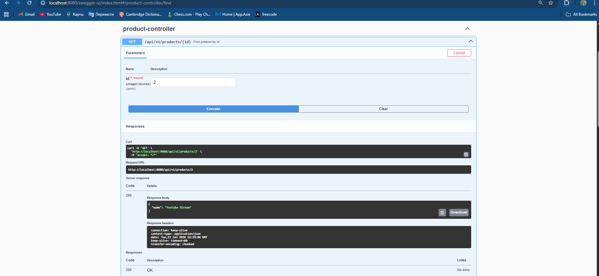
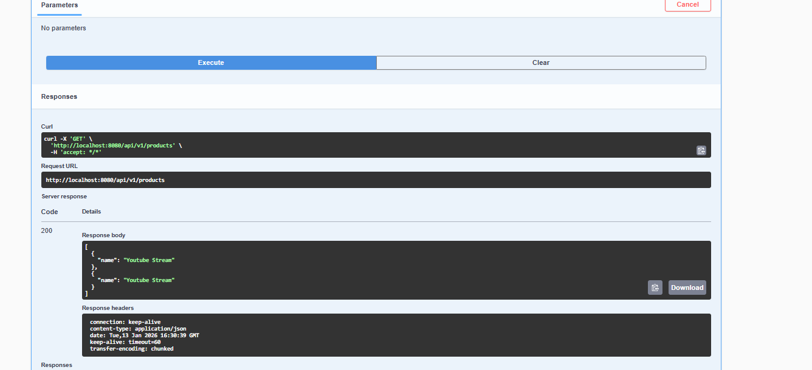
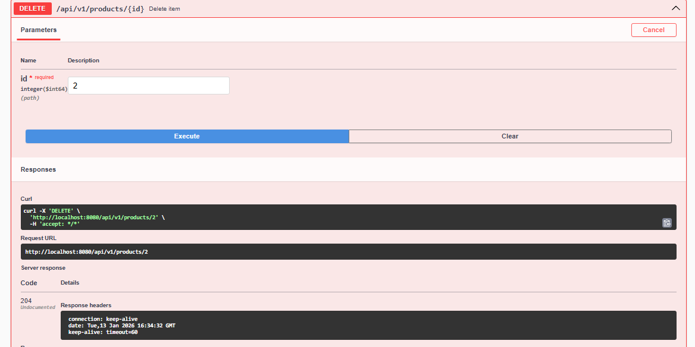
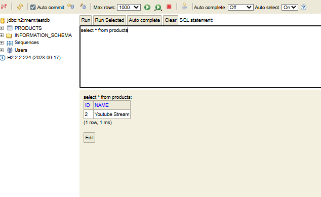

## Task 2 – REST API Application

### General Overview

In Task 2, I developed a **REST API application using Spring Boot**.  
The application works only on the backend side and communicates with clients using **HTTP requests and JSON responses**. There is no frontend interface; all interactions are done through tools such as **Swagger UI** or **Postman**.

The goal of this task was to understand how a REST API is designed, how requests are processed, and how responses are returned in a structured and predictable way. The application manages product data and follows a clear layered structure, which is commonly used in real-world backend systems.

---

### Requests and Responses – Brief Explanation

The API supports basic operations for managing products. Each operation uses a specific HTTP method and returns an appropriate response.

---

#### Create Product (POST)

This request is used to create a new product.

- The client sends a **POST request** with product data in JSON format.
- The application reads the request body and converts it into a Java request object.
- The product is processed and saved.
- The response contains the created product data along with a confirmation status.

Typical response:
- HTTP status **201 (Created)**
- JSON object representing the created product

---

#### Get Product by ID (GET)

This request is used to retrieve a single product by its identifier.

- The client sends a **GET request** with the product ID in the URL.
- The application searches for the product.
- If found, the product data is returned.
- If not found, an error response is sent.

Typical response:
- HTTP status **200 (OK)** when the product exists
- HTTP status **404 (Not Found)** when the product does not exist

---

#### Get All Products (GET)

This request is used to retrieve all products stored in the system.

- The client sends a **GET request** without an ID.
- The application returns a list of all products.
- If no products exist, an empty list is returned.

Typical response:
- HTTP status **200 (OK)**
- JSON array of products

---

#### Update Product (PUT)

This request is used to update an existing product.

- The client sends a **PUT request** with the product ID and updated data.
- The application checks if the product exists.
- If it exists, the product is updated.
- If it does not exist, an error response is returned.

Typical response:
- HTTP status **200 (OK)** when update is successful
- HTTP status **404 (Not Found)** when the product does not exist

---

#### Delete Product (DELETE)

This request is used to delete a product.

- The client sends a **DELETE request** with the product ID in the URL.
- The application removes the product if it exists.
- No data is returned in the response body.

Typical response:
- HTTP status **204 (No Content)** when deletion is successful
- HTTP status **404 (Not Found)** when the product does not exist

---

## H2 Database – Brief Overview

In this project, I used the **H2 in-memory database** to store product data for the REST API.  
H2 runs together with the Spring Boot application and does not require any external database setup.

The database is used only while the application is running. When the application is stopped or restarted, all data is cleared. This makes H2 suitable for development and testing.

H2 is integrated using **Spring Data JPA**, which allows the application to automatically create database tables based on entity classes and handle data operations without writing SQL manually.

---
### Summary

Task 2 demonstrates how a REST API handles different types of requests and returns appropriate responses using standard HTTP methods and status codes. The application processes JSON data, handles errors properly, and can be easily tested and documented using Swagger UI.
